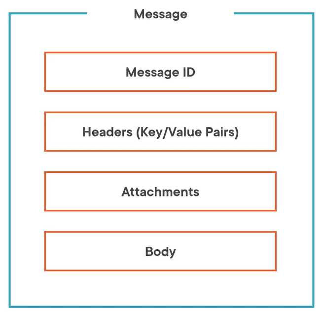
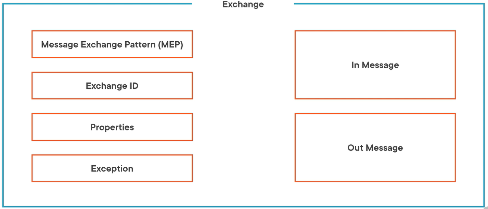

= Apache-Camel
:toc: left
:toclevels: 5
:sectnums:
:sectnumlevels: 5

* https://tomd.xyz/camel-tutorial/

== Fundamentals of Integration with Apache Camel By Michael Hoffman

=== Course Overview

*Course Overview*: Done

Hi, I'm Michael Hoffman. Trying to integrate disparate systems has long been a developer's worst nightmare. It's painful dealing with systems that don't use the same protocols or may not even be reliable. What if there was a tool that could ease the pain of integration and let you focus on adding real value to your software? *Apache Camel is an open‑source integration framework that aims to reduce the challenges that come with system integration. Camel is a mature routing engine that supports communicating with over 300 different endpoints across over 50 different data formats. It's based on tried and true integration patterns that have been around for almost 20 years*. In this course, you'll learn the foundational concepts of Camel, as well as the patterns that can be applied to solve your integration needs. I'll demonstrate the process of building routes and provide demonstrations using real‑world scenarios. Along with being an author at Pluralsight, I'm also a principal architect at NVISIA. Frequently, I deal with large‑scale integration problems. I always know that I can turn to Camel as an option for solving these problems, which is why I'm so excited to share this topic with you. I hope you'll join me on this adventure as we explore the Fundamentals of Integration with Apache Camel here, at Pluralsight.

=== Introducing Apache Camel

*Introducing Apache Camel*: Ok

Hi, my name is Michael Hoffman. Welcome to my course on Fundamentals of Integration with Apache Camel. My goal is to provide you with everything you need to start using Camel effectively in your software solutions. You may be asking, why should you spend time on this course? Why learn about Apache Camel? Over time, architectures come and go. The one constant crosscutting concern across all of these architecture approaches is integration. *Integration between any two things is Apache Camel's sweet spot. Camel is a lightweight routing engine. It lets you define how you want to ingest data, what you want to do with the data, and then where do you want the data to be output. Along this pipeline, Camel has an entire pluggable framework to support just about anything from file processing to cloud integration.*

*One of Camel's key principles is flexibility. It's called the Swiss army knife of open source integration. As you likely know, with great flexibility comes great complexity. In fact, if you go to Camel's website and click through to the page, What is Camel, it's going to point you to a Stack Overflow post. That post has over 20 different answers. The last answer even mentions a Turing machine, but it's this flexibility that also has made it one of the most active and popular frameworks from the Apache Software Foundation over the past 14 years*. As the course proceeds, I'll do everything I can to get you over the hump of technical jargon and give you real concepts and scenarios to ensure that you're getting the most from Camel. I have intentionally structured the course to start by focusing on the concept of Camel's RouteBuilder. In this module, you'll see your first route be built, and you'll explore some big picture concepts. Next, you'll get a deeper dive into route building. I'll demonstrate a route that supports ETL processing from a file to a REST service. You'll expand past route building as we'll cover additional Camel concepts like asynchronous processing, circuit breakers, retries, and error handling. Next, I'll cover routing that supports messaging between microservices where I'll apply many of the concepts that you just learned. In the next two modules, I plan to cover Camel products that are relatively new to the framework. I'll demonstrate implementing routes for event streaming using Kafka. Then I'll finish the course by demonstrating how routes can be deployed serverless on Kubernetes. Let's talk about who this course is for.

*Who Will Benefit from This Course?*: Ok

The course material is targeted towards practitioners and architects. I assume that you are or will be dealing with some moderately complex integration stereo. It might be building the coexistence of data between a legacy system and microservice. It could be adding a layer between your application and a cloud provider to avoid vendor lock‑in. I've not assumed that you've developed with Camel in the past, but if you have, I hope you learned something new from watching. Next, let's see if we can get course material for the demonstrations.

*Obtaining the Course Material*: Ok

There are several sites where you can find reference material for this course. The main project with demonstration setup and instructions can be found at the GitHub link displayed. It will guide you through the projects for each module that support my demonstrations. The course is based on the latest version of Apache Camel, which was 3.11 at the time of publishing. I plan to continue upgrading and supporting demonstrations as needed. Apache Camel currently supports JDK 11. A release in the near future is expected to add support for JDK 14. Our demonstration code was written against JDK 11. Finally, you can use any IDE for trying the demonstrations on your own. For this course, I use the latest version of IntelliJ IDEA, Ultimate Edition.

*Understanding the Structure of a Route*: Ok

If you are new to Camel, you've probably been asking yourself what does a route actually look like. To answer this, let's start with the basic parts of coding a route. I'm going to walk through a route structure using Camel's Java‑fluent DSL. *A route begins with a from definition. This informs Camel what endpoint data is being transported from. Next, there are one or more processing steps. Camel will exchange data through each of these processors. Think about the actions that you can take on the data in each of these steps. Do you need to validate data, enhance it, or maybe split it? Ultimately, the route ends with a to definition. This informs Camel what endpoint that data should be transported to after processing is complete*. What if I fill in these blocks with real endpoints of processing? I'm going to demonstrate building out a route. The route will accept input from the console, transform it, and then send the transform message back to the console. A reminder that you can find the course material on GitHub. The link is found at the URL displayed. This demo will use the routetoconsole project module. I've opened up my development environment, as well as the application class RouteToConsoleApplication where I'll be adding the route. The first step is to initialize Camel's standalone runtime. To do this, I'll create an instance of Camel's Main class and call its run behavior. Now, it's not common for me to run Camel's standalone, but if you needed to run Camel from a command line, it is supported. The Main class will start up Camel's container and initialize its context. Next, I need to add the route. RouteBuilder provides Camel's fluent DSL for defining the route. This code adds the route to the Camel context. I'm going to start by adding in the from, process, and to definitions that I explained earlier. The route defines where Camel should route data from, how to process it, and where it should route data to. For this route, I wanted to accept input from the console, change the data, and the return output to the console. How can I accomplish this? I need to use Java's system input stream and system output stream. Camel just so happens to have a corresponding component named stream. Let me add it now. You may be wondering what the strings are that I just added. On the left side of the colon is the name of the component. In this case, stream. If you were using Camel's file component, you would expect to see the word file on the left. This string is a URI. All route definitions use the same standard URI pattern. Note that the forward slashes are optional. To the right of the forward slashes, I have defined a path. I have specified in for the from definition and out for the to definition. This just says route from system in and route to system out. Having only a prompt can be confusing, so how do I add text to the prompt? I can do this by adding query parameter options to the URI. Every component supports configuration through URI query parameters. The parameter added tells the stream component to prompt a text message as part of system in. This addresses the from and to definitions, but now I want to process the input message. I'm going to add code to the process definition that enhances the text typed by the user. I've introduced a new concept here called the exchange. *An exchange transports data through the route. The exchange contains a message with a header and a body. When a user types text into the console, that text is stored in the body of a message. The message is then sent to the processor as part of an exchange, that completes the route*. Next, I'm going to start the application and try it out. I've opened up a terminal in IntelliJ and navigated to the root of my project. I've already compiled the code. Because I'm using the Camel Maven plugin, I can run the command mvnw camel:run. I see here that the application has started successfully and the prompt is displayed as I was expecting. Let's take a moment to look at the log for startup. As I mentioned earlier, Camel starts up a Camel context. At startup, Camel will tell me the route or routes that were initialized. I didn't provide a unique name so Camel just called this route route1. I'll enter some text and should see the message get repeated back to me. Once I hit Enter, the message was streamed into my route. The processor added the text you said and then the route output the full message back to system out. As a last step, I'll hit Ctrl+C and terminate the route. Here, the log shows that Camel has successfully stopped the route. I chose this type of route because I thought it was better than the traditional hello world example. If you'd like to do some additional exploration, try extending this example to behave like a CLI would. For instance, have your processor check the type of command entered and respond appropriately. Let's revisit some of the concepts that I just introduced in this route. Before summarizing the module, I want to touch on a few key concepts in the route that I just demonstrated. First, did you find yourself thinking how easy this code is to read and understand? This has long been one of my favorite features of Camel. *The DSL clearly and intuitively describes the Camel API*. This makes it easy for anyone to pick up the code and tell what it does. You'll see more examples of this as we continue. The from and to definition of the route set a Uniform Resource Identifier, or URI. This provides a consistent way of identifying and configuring the endpoints of a route. As part of the endpoint URI, I define the Camel stream component. Components like stream are a key differentiator between Camel and other integration frameworks. *Few integration products can match the over 300 components that Camel supports*. *When I coded the from and to definition, I was reading and writing to a stream type, yet the message body in the processor was a String type. Did you wonder why? The reason is that Camel provides you with automatic type conversion as part of transporting data. This is another one of my favorite features. Camel is doing a lot of the grunt work for me transforming to and from a stream*. *While Java has certainly improved over the years, reading from and writing to streams has rarely been easy or fun. I'd rather let Camel do it*. Lastly, were you confused by the process logic? Did you notice that I set the body of the inbound message? Shouldn't I have updated the outbound message? This could be confusing. Camel automatically sets the inbound message to the value that gets output by the previous step in the route. Processors will normally only update the inbound message. With that, let's summarize what was covered in this module.

*Summarizing the Module*: Ok

In this module, I introduced you to the Apache Camel framework. You built your first route using features of Apache Camel. Hopefully the demonstration gave you a glimpse of Camel's simplicity and power. Next, I covered four key concepts. I focused on the process of *building a route*. This included defining the input, processing, and output steps of a route. I used the *Java DSL* for building the route. The DSL offers a simple‑to‑understand and intuitive way to interact with Camel's API. I implemented a *processor* to show you how to manipulate data in transport. And finally, I explained how that transported data is captured as part of an *exchange*. In the next module, you'll be able to take what you've learned and expand upon it with a slightly more complex route. I'll show you some additional approaches for making your route production ready, *including error handling, logging, and configuration*. The goal will be to build a route for ETL processing from a file to a REST service.

=== Camel Routing for ETL

*Module Overview*: Ok

The last module was meant to get you acclimated with Apache Camel. You saw some of the basics of route building, and you were introduced to several foundational concepts. This module is going to cover the end‑to‑end delivery of a Camel route When selecting Camel as an integration framework, there is some analysis you need to do. I'll be covering several considerations that you're going to need to make as part of selecting Camel. Some questions will include, what is the approach for middleware in your system? What type of architecture do you support? What are the key drivers for selecting Camel over other integration products? Next, I'll show you the process of designing a route. Route design starts with component selection. You need to define what the route endpoints are. You need to choose which component will service the endpoint and how the endpoint will be configured. Finally, you need to design the rules for processing the data. As a final step, I'll demonstrate implementing the route logic. Route implementation can be done iteratively. You will also need to choose a strategy for testing the route once it's built. By the end of the module, you should have a complete picture of the route building process. Let's start with analysis.

*Analyzing an Integration Problem*: Ok

In the last module, I spent time answering the question, what is Apache Camel? Now, I want to help you answer the question, why should I use Camel? Is it the right choice to solve my integration problems? Can it work with my architecture? While I can't cover every single scenario you may have, I can provide you a general framework for arriving at a decision. Starting at a macro level, you need to consider the overall approach that you or your company is taking from middleware. If you have integration products already established or cloud‑based middleware services selected, Camel could increase the overall complexity of your middleware. You should be asking yourself, what specific gap or gaps is Camel going to fill that these services can't already provide? *If this is a one‑off integration, introducing Camel means an additional container and a new set of libraries for your system*. You need to consider what impact this is going to have. It's my opinion that Camel is lightweight and viable even with only one route. Finally, I found Camel to be applicable in just about any system architecture approach. Let's cover some common approaches in more detail.

*Integration with a Monolith Architecture*: N/a

* In the current scenario, it is not appicable, so don't worry about it.

I'm showing a simplified view of a monolithic architecture. It has one or more modules, likely to correspond with domains like customer, orders, and warehouse. Usually these modules read from and write to a persistent store. How would you introduce Camel routing in this architecture? It's my opinion that Camel should be a separate service from the monolith. Keeping integration concerns separated from your business logic and transactional concerns allows you to evolve and scale each separately. There are some trade‑offs. The modules in your monolith now need to expose external services for routing. The most common question to ask yourself is, how much refactoring do I need to do to isolate the logic that you're exposing for integration? Your runtime is distributed across a network. This opens a whole host of questions, including those around reliability and observability. Finally, your code is no longer centralized and delivered as a single project. This could result in more complex development and deployment. You may be thinking those are significant challenges. Why not just add Camel directly in the application? If your integration is relatively simple, one strategy is to start with Camel inside the application, but have an eye towards future separation. You can add your route and have it communicate with an integration API as a façade to your business logic. Then, when you separate the routes, the integration API can be externalized. As you add more routes, can you think of some of the scaling issues that you might face? Let's take an example where the integration is from a file. If the file is small, the resource impact to my application will be minor. But what if I have to load a large file? What if I have to integrate more files in the future? The contents of the files are going to be loaded into memory, and the route will consume threads and CPU for processing. You should be asking, how do I assure that my integration doesn't impact important business processing by the application? Next, consider the impact of routing to other endpoints. Let's say that your Camel routes need to integrate with other services like email or messaging. Similar to the file integration concerns, what happens if these services are slow? Again, the route is consuming resources that might be valuable to key business transactions, like placing orders, for example. If scaling becomes or will be a concern, separating your Camel route from your application can greatly reduce the chance of impacting the application itself. It's not foolproof though. A large number of calls to the monolith can still have the same impact on resources. However, there are strategies for reducing impact, such as adding rate limiting to the number of requests processed at a given timeframe. Hopefully this gives you a good breadth of considerations for a monolithic approach to integration. Now let's look at another architecture type.

*Integration with a Microservices Architecture*: N/a

With a microservices architecture, the monolith has been broken up. Front‑end gateway apps have been split from back‑end server processing. The back‑end microservices are then invoked through service discovery. Some of the trade‑offs I mentioned for a monolith are likely to have been solved in the microservices architecture. For example, services are already externally exposed and distributed across the network. I'm again of the opinion that Camel routing logic is a separate service. Camel routes would call services via service discovery, similar to other gateway apps. This approach isn't without its own challenges. Again, you need to consider the impact on key business processes. Similar to the monolith approach, you can follow the strategies that limit the rate of calls to your microservices. For example, you could implement a circuit breaker that trips when a service endpoint begins to time out. Another approach I've seen is to partition out services to different clusters that serve different purposes. You could have one cluster that services requests for business transactions and another cluster that services requests for integration transactions and other back‑office processing. Another consideration is the availability and responsiveness of microservices. Additional consideration may be needed for your integration routes to support things like retry logic and error handling. With an understanding of the middleware and architecture considerations, the last step is reaching a conclusion that Apache Camel is the best option for your integration.

*Drivers for Choosing Camel*: Ok

Earlier, I touched on several features that make Camel popular, including its simple and intuitive *DSL, its support for automatic type conversion, and its support for over 300 components*. In addition to these features, there are several drivers that you need to consider when evaluating Camel. In my opinion, the key driver for choosing Camel is if you are comfortable with custom developing your integration routes. This is opposed other popular integration products such as Apache Nifi, which come with a UI, as well as drag‑and‑drop support for route building. Apache Camel is Java based, which means you need to understand Java in order to build your routes. *If your environment already has a lot of custom development, your Camel service apps will benefit from existing development tools and frameworks, CI/CD pipelines, version control, deployment strategies, and infrastructure. Another driver for choosing Camel is the type of production support that you require for your routes. Camel is a robust framework that provides hooks for viewing the metrics, health, and status of routes*. Unlike other integration products, there's no UI for Camel out of the box; therefore, there's no visualization of support data out of the box. If you are comfortable with building out your own custom view of support data, then Camel might be the right choice for you. Along with observing production status, the maintenance and administration of routes at production time is another consideration to make. *#You should be asking questions such as, do I need to increase thread count in production if processing gets backed up? Or, can I stop an individual route if it's causing performance issues? Camel support strategies for solving these; however, it requires a custom approach#*. 

*Underscoring production support, and a key to success with Camel, is a sound operational strategy. This can ensure integration services are properly managed and maintained. It can also help to keep operating costs lower. For example, other integration products are often centralized and need to always be running. Having separate Camel services means you can turn off individual service runtimes or even individual routes when not being used. Hopefully this provided you with a framework for deciding whether or not to use Apache Camel*. Next, I'm going to provide you with a walkthrough for designing an integration route from scratch.

*What Is the Integration Problem?*: Done

The integration problem for this module focuses on customer data quality. Customers self‑report data on websites. It's possible for this data to be inaccurate or incomplete. In fact, it's common for companies to have entire departments dedicated to the accuracy of customer data. Having accurate account data can support a business in a variety of ways. For example, it can assure packages are shipped correctly without additional fees or it can determine if a company is creditworthy. Let's focus on the challenge of shipping addresses. A common business practice is to send customer data to a third‑party entity and receive back address corrections. This helps assure that packages are delivered to the correct customer address. Here, you see a sample of the CSV file contents that would be the basis for this module's demonstration. Processing file contents is a common ETL integration problem. Extracting from a file needs to take different sources and formats into consideration. Transformation complexity depends on how dispirit the source and destination formats are, as well as the rules to be applied. Loading the data also has several considerations, for example, the performance and availability of the destination.

*Designing the Route*: Done

With this integration problem as our context, how do you go about designing a Camel route to solve it? I plan to walk you through my approach to basic route design. Hopefully it could serve as a foundation for your own approach. As the course proceeds, I'll build on this foundation by covering more advanced design considerations, such as notifications, error handling, and asynchronous processing. A good starting point of route design is understanding the frequency of route execution. *Camel supports several options for executing routes on a scheduled basis, including a cron‑based scheduler, support for Quartz, and support for Spring Scheduler. If your route doesn't execute on a schedule, Camel also supports a polling consumer. This approach is for more frequent execution, such as polling a file directory every 10 seconds for new files. Camel also supports executing your routes on demand*. This approach is often paired with scheduled route execution. For example, if a scheduled route fails to run over the weekend because of a corrupt file, I can fix and load a valid file and then run the route on demand.

*Component Selection*: Done

For our route, a file can be dropped to a shared drive at any time. To read the file, I'll be using a Camel component. Several Camel components support a pluggable consumer where I can define my strategy for execution frequency. What does this mean? It means that I can directly configure the component to run on either a scheduled or a polling basis. The next step is to select the components that you'll be routing from and routing to. Apache Camel proclaims itself the Swiss army knife of integration. In most cases, finding the right component is easy. For example, to route to Amazon's SNS service, you use the AWS SNS component. In some cases though, component selection is truly like a Swiss army knife. You need to check five different slots on the knife in order to find the right tool to use. The best way I found to discover the right component is to browse the main component list on the Camel website. The link I'm displaying provides the latest list. For our route, the core file component will be sufficient. If you need to read the file using FTP or from providers like AWS and Google, Camel can also support you. The file component will read the shipping address file from a file system. Along with reading the file, the component includes many other features to support your file processing requirements. Once you choose a component, it's important to look through its page on the Camel website. You'll want to explore the options, defaults, and potential challenges. This will help you prevent surprises and ensure a successful delivery. As with all Camel routes, a component is used as part of a URI to define an endpoint. *The component name is file and the URI path is a directory on the file system. One option I plan to use for the route is include. The value for the include option is a filter. The filter is a regex pattern that tells Camel if a file name in the directory should be included for processing. The second option I plan to use is the move option. After Camel processes a file, it will move or archive the file from the directory path to the value that I specify in this option*. As I mentioned earlier, the file component supports a strategy for the frequency of execution. For this route, I'll just use the default behavior, which is to constantly pull the directory for new files. Now I need to select the component type I'll be routing to. The route needs to make a REST call to a service so it would seem obvious that a REST component would be the best option. Here is one instance where component selection can become confusing. I've listed six different components that support producing a REST call. Again, making the right selection does require reviewing the component page and ensuring it meets your requirements. For most routes that need to call REST endpoints, the REST component should be sufficient. Configuring the REST component is pretty straightforward. The URI defines the HTTP method to be used in the path of the service call. The only option I plan to set is the host of the service.

*Designing Route Processing Steps*: Done

To recap the design to this point, the route will start by polling and reading a file from a share drive. And the route will end by calling a REST component with the file contents. The last step of design is to process the data from the file, transform each line, and then send the data to the service. The step of designing and implementing raw processing requires a strategy. You know your starting point, and you know your destination, but you need to figure out what steps to take in order to get there. *The Camel framework is built on the pattern of pipes and filters. In order to get the most benefit out of using Camel, I need to think about how I can break a processing problem down into chunks or steps. Each step or filter has an input and an output. The output of one filter becomes the input of the next filter. This allows me to chain the steps of processing together and easily add or remove a step of logic, if needed. Pipes then connect one filter to the next*. Throughout the design of your processing steps, you should be asking yourself, does Camel provide a feature for this requirement or do I really need to write my own logic? Ideally, you want to leverage Camel as much as possible as it reduces the time and effort of having to build, test, and maintain your own custom logic. I'm going to walk you through the strategy I follow for flushing out the processing design. I start by determining the data types coming to and from my routing components. Then, I determine what logic is needed to transform the data and complete the route. The route is processing files in CSV format. I need to read the file and format the data for individual REST service requests. At this point, I would search Camel's website for a CSV formatter. Camel supports a formatter for CSV data via the Apache Commons CSV library. What does this mean for my processing step? I should be able to use the Camel DSL to define how I want Camel to unmarshall the data. The output of this step will be a list representing each line of the file, which will make it easier to process into REST requests downstream. Now that I define the data type coming into the route, I need to determine the outbound data type. Given that I'm routing to a REST service, I need to know the content type that the service endpoint accepts. In this case, it's JSON. This means I need a data formatter that will marshall the data into JSON request objects for the service to consume. To find a JSON formatter, I would again search Camel's website. While there are several options available, I'm going to choose the Jackson library. This gets us closer to the final design, but there's still a disconnect. The REST endpoint accepts a single address update, but the list of lines represents multiple address updates. I need a way to separate the lines. A common approach I would use for this scenario is Camel's implementation of the Splitter pattern. Splitter is a routing pattern that transforms a message with a collection into separate messages for individual processing. For example, the incoming message with a list of 1000 lines would be split into 1000 messages. Those messages would be individually routed to the destination. Each line output from the Splitter is, itself, a list of columns from the row in the file. The last gap is to transform each line from arbitrary strings into the REST endpoint request object. To fill this gap, I plan to implement a Mapper class. It will be a simple bean that transforms the line from the file into a customer request object. With the Mapper in place, I now have an end‑to‑end design for the route. With the design finalized, the next step is to demonstrate implementing it with Camel.

*Structuring a Camel Integration Project*: Done

As you start a Camel integration project from scratch, there are considerations to make. The first consideration is how granular your integration service project should be. Should you have one integration project that hosts all of your routes or should each route be part of its own project? The common approach is to break out projects by a logical grouping first, such as by domain. This would result in projects like customer integration, order integration, shipping integration, and so on. If a route uses a high volume of resources, consider breaking the route out into its own independent project. This helps reduce the proliferation of projects while still meeting the need of high‑volume routes. Camel can run as an independent framework, as I demonstrated in the previous module. It can also take advantage of running on top of Spring Boot. Given the popularity of Spring Boot as a server framework, it's likely you'll need to decide between running standalone Camel or Camel on top of Spring Boot. If you're already using Spring Boot for services and applications, I would recommend using Camel and Spring together. This keeps consistency for concerns like logging, security, and discovery. Spring Boot will auto‑configure both your routes and your Camel context as part of startup, which is a key benefit of using the frameworks together. In addition to consistency and configuration, running Camel on Spring Boot allows you to route from and route to Spring beans in the Spring container. For the demonstration project, I chose to run Camel with Spring Boot because of these benefits. Another decision to make is the DSL language for your routes. In earlier versions of Camel, XML was a more popular approach. However, most implementations I see these days use the Java DSL. Given this, I chose to use the Java DSL for this project. As a general rule, you should structure your project and code to maintain a separation of business logic and integration logic. As I described earlier in the course, this separation allows you to isolate, evolve, and scale your integration separate of your business processing. Now that we've considered project structure and dependencies, let's look at how development can be approached.

*Implementing Route Processing*: Ok

Image/Pending

*The best strategy I found for Camel route development is to take an incremental approach guided by tests*. What does this look like? Let's start with the endpoints I'm routing from and routing to. Can you think of some challenges that you're going to face when coding the integration logic for these components? Think about the file component first. Would you create separate files for each scenario that you need to build and test for? What if the file is corrupt or invalid? How would you handle it? For the REST component, what if you don't own the service that's consuming your route data? How do you assert the service integration as correctly saving data? Given challenges like these, how can you make developing with these components easier? Camel offers a full‑featured test API to support faster development of routes. Included in the API is the ability to mock endpoints in your from and to definitions. Mocks provide you control over the production and consumption of data in your route. This supports inserting any exchange as part of the mock and then performing assertions on the result of the route. The mock file component can use a Camel concept called a producer template to produce data into the route. The mock REST component can intercept the exchange and perform assertions without calling the actual endpoint. This is really powerful because I can focus on quickly and accurately building the route processors before focusing on integration concerns. The next step is to incrementally add processing. One of the hardest parts of incrementally building a route is making sure that each processing step is correctly connected. For example, how would you verify if the unmarshall step actually formatted the data from the file? I recommend turning on Camel's tracing feature during development and testing. This allows you to review the exchange and verify each processing step. Once the route is defined, you can turn tracing off and then build out your test case scenarios to assert the results. Hopefully, you can see the benefit here of rapidly building your route without the complexities of determining where the file came from or if the downstream service is in a testable state. Let's see what this approach looks like in action. I'll start with implementing the routes processing logic.

*Camel Testing Concepts*

I'll be demonstrating a route implementation where I'll be introducing several new concepts as part of unit testing. The test I create will have three annotations added. The first is an interception strategy named @MockEndpointsAndSkip. It defines pattern matches for any endpoints that should be auto mocked. I just need to define the mock that should act as the replacement, and Camel will take care of the rest. The second annotation I'll add is named @UseAdviceWith. This allows you to add or change parts of the route before it started. In our case, I want to replace the file component with my own component to take control of what file gets sent. I'm using Camel's component named Direct as it's a way to directly execute the route. The last annotation will be on a member of the test class that is of type mock endpoint. This annotation is named @EndpointInject, and it will tell Camel which endpoint this mock should be used in place of. Mocks allow you to perform assertions on conditions, like the number of messages received and the contents of the message body. ProducerTemplate is a class that allows you to produce a message to the route. For this implementation, I'm going to send a file.

*Demo - Implementing Route Processing*: Pending.

Let's start the demonstration. The goal of this demo is to flush out the logic for processing. After this demo, I'll cover the next step of development where I'll integrate with the file and REST component of the route. You can find the demonstration code at the GitHub link displayed. The code is in the demos path for module 3 under the project, customer‑integration. I've opened my development environment along with two application classes. The first class is named AddressUpdatesToCustomerServiceRoute. This is where I'll define the route logic. Since I'm using Spring for this demonstration, one of its benefits is that I can annotate a route builder class as a Spring component. Camel will then take care of automatically loading it and executing it in the Camel context. Just as in the previous route demonstration, I'll start by defining the from and to definition in the configure method. If you remember in the last demonstration, Camel provided a default name for my route when it was initialized. It's always a good idea to define a specific name for your routes. As you'll see shortly, the name can be used for identification and testing or for other purposes such as logging and notifications. Since I'm routing from a file of customer addresses and decided to use the file component, I'm going to add it for the endpoint and the from definition. For now, I'm not going to define the file name path or any other attributes of the component. I just want a placeholder that I can mock out for testing. Next, we need to define the to definition of the route. I'm routing content that I've processed from the file to a REST endpoint for a customer account service. The URI I entered includes identifying rest as the component name, the method type as patch, the path as customer, and the host as a configuration. You may be asking, if you are mocking this endpoint, why can't you just put the component name like in the from definition? Even though I'm mocking the endpoint, Camel will still check if the endpoint URI is valid. What I entered was the bare minimum URI required. This is enough to run an initial test on my route. The next step is to implement the test case. I'll open the file, address‑updates‑to‑customer‑service‑route test. The first step is to annotate the @Test class with the annotations I described earlier. The first annotation tells Camel what components to mock, which, in our case, is the file and rest component. Then, the second annotation tells Camel that I want to @UseAdviceWith for enhancing the route. Because I'm using AdviceWith, Camel isn't going to automatically start the route for me. I'll need to autowire the Camel context and call it's start method in the test. I want to be able to produce a file to the route, so I'll also autowire Camel's producer template. In the test method, I can call this ProducerTemplate's sendBody method to send any content I want into the route. The benefit is that I control what information is passed to the route and tested. I'll be adding this method shortly when building out the test case. The last member I need on the test class is the mocked endpoint. I'll add it now. Camel has a mock component that defines the endpoint URI that I want to replace. I can then use this restEndpoint test member to make assertions on data that gets passed. Now, I need to complete my test case. I wanted to find how the file gets produced to the route, and then I wanted to find the expectations for the mock that consumes it. Similar to the mock, I'm going to use Camel's AdviceWith to replace the from definition. The static method I've used intercepts the start of my route. It updates the route by replacing the from definition with a direct component. I've also included an arbitrary name for the URI of file:start. Now I can use the producer template I defined to send a file into the route, but first I need an instance of a file. Let me add that now. I provided you a CSV file of the addresses that are being updated. Did you notice that I'm using the type, GenericFile? This is actually a Camel class for wrapping file processing as part of routing. It's significant because you need to make sure you are producing the same content as the component would. Otherwise, you may get different results or errors when you move to integration testing or full route execution. The next step is to add the producer template call. The sendBody method will send the file to the route via the direct component that I defined. This is a basic pattern that you can follow for most production of content to a route. The last step of the test is to tell Camel what the mock REST endpoint expects. I'll add the expectation and assertion calls now. These two lines of code tell Camel that I expect one message to be sent to the REST endpoint and to assert all validations were satisfied. This should be all I need to get a passing test. Let me run the test. I'll open up a terminal window. And in the terminal, I've navigated to my project. I'll run the command to execute tests, which is mvnw test. Here you can see that the test completed successfully, and the file was sent through the route. Let's scroll up and review the logs. This line shows that Camel applied the mock endpoints and skip annotation. Next, let's look at how Camel configured the route using AdviceWith. The log shows how Camel replaced the from definition, including displaying the new route definition. Then, the log tells me that the mock of the REST endpoint was successful. If I scroll down, I should see the assertion. Here, the assertion tells me that the exchange message successfully made it through the route. Once I'm finished coding the route, I'll return to this test, and I'll enhance it to check for actual content. Let's build out the processing steps, next. First, I want to show the tracing property that I mentioned earlier. I'll open the file, applicationtest.properties. This property will provide me with trace‑level details on my route, including the type and contents of the exchange. It's really helpful for supporting initial development, as you'll hopefully see shortly. Open up the route builder again. The first processing step is to unmarshall the file data that gets produced to the route. In order to accomplish this, I need to tell Camel to format the file data. I've already defined a Spring bean for this. I'll add the CSV data formatter as a member of the class, and then include it as part of the constructor. Now I can add the unmarshall definition to the route. Let's open up the terminal window again and run the test. I want to call out a section of the logs. You can see here that the tracing information tells me the Exchange Id, the BodyType, and the data inside the body. It's a good way to initially verify that the unmarshall worked, as the result was an array list of rows from the file. Next, I'll go back to the route builder and add the remaining steps. If you remember from the design, I need to process each row in the list from unmarshalling. The reason is that my REST endpoint only supports a single customer record. I'll define a splitter. The splitter takes something called an expression. Camel supports a full API for expressions that allow you to perform evaluations against an exchange. For example, we could check if the exchange contains certain text or is of a certain type. In this case, I just need to use an expression to get the body of the exchange message. Let me enter that now. Camel will now route each row from the file through the remainder of the route definition. Since our REST endpoint doesn't expect a comma‑delimited string, I need to transform each row into a request object. I've already created a simple mapper for this called address‑update‑line‑to‑customer‑mapper. I'll define the processing for that. What I've specified is a bean definition. As the name implies, I can route the exchange to any bean in my container. Camel supports its own bean container. And since I'm using Spring, I can also route to Spring beans. The second parameter passed to the bean definition is a specific method on the Mapper class that will be executed by Camel. Let's open up the Mapper class. If you look at the method signature for the process method, you'll notice the parameter is a list. Is this the parameter type that you were expecting, or were you expecting a Camel class such as Exchange? One of the benefits of routing to a bean is that Camel will take care of the mapping of the body of the exchange to the method input for you. This is also a way for you to integrate with other APIs or common libraries. For example, you could have a common library to send notifications to Slack and have your routes use bean definitions for calling the API. Let's return to the route and finish the processing logic. To recap the processing, Camel will unmarshall the CSV data from a file using a CSV data formatter, split the lines to be processed individually, and then each line will be mapped to a customer object. I now need to marshal the object into JSON format so that it can be sent to the REST endpoint. I'll add the code now. I've defined marshaling using a JSON formatter. Camel will use the Jackson library to perform the formatting, as I included it as a project dependency. Let's run the test again to see the results. Here, we can see the trace of each step in the route and the input to the step. The unmarshal step accepts a generic file and returns a list. This list becomes the input to the splitter, which will separate each line into its own subroute. The mapper bean accepts the list of data from the line and returns a customer object. Finally, the REST column's made with a JSON string, representing the customer to be patched. Let's open the route again. The processing logic is now in place, but I'm still using mocks for the from and to definitions. Let's address this.

*Implementing Route Integration*

In the previous demonstration, the route endpoints were mocked so that I could rapidly develop the processing logic. The next step is to complete the definition of the file and REST components. Let's consider the file component first. I'm showing what the updated file component configuration is going to look like. The URI path is the directory of the shared folder. To support different environments, I'm going to set it to a bind variable. Similarly, I'm using a bind variable to define the file name pattern that should be processed. Finally, I'll use a bind variable to define the directory where the file should be archived to after processing. This is the minimum configuration needed for the file component. Now let's look at the REST component. The REST component will also make use of bind variables. However, I have an interesting problem that I discovered when I was doing integration. I needed to send the customer ID in the path for each request. Camel's to definition does not support dynamically computed endpoints. Therefore, I need to switch to using the toD, or to dynamic, definition instead. I'll also need to update processing logic so that the toD definition can access the customer ID. The REST endpoint then is defined with an HTTP method, in this case patch, and a path. Note here the exchangeProperty uses a different syntax for binding. This binding is Camel's Simple Expression Language. It's a very powerful and easy way to access data in the route, including data from the exchange. Finally, a host parameter is defined, again with a bind variable to support different environments. Once the components are configured, the next step is testing the integration. This step is often the most challenging. I do recommend writing automated integration tests when it's possible and when it adds value. Heavy confidence in your route execution is important. That said, I often find myself limited in the amount of automated integration testing that I can perform. One approach that helps with these limitations is to leverage mock servers. Mock servers proxy real requests and can return mocked responses. One key benefit is that I can get a repeatable response from the route destination. You may find yourself running tests manually. I recommend using a tool or script. This can ensure consistency in testing, rather than just dropping a file in a directory and hoping that it works.

*Demo - Implementing Route Integration*

Let's complete the route for this module. Once again, the project can be found at the GitHub link displayed. I'll continue to build up the customer integration project in the module‑3 path. I've opened up the RouteBuilder class. I'll be replacing the from definition with a configured endpoint. The bind variables point to values found in the application properties file under the Project Resources folder. Again, the benefit of externalizing these values is that I can change them in each environment that I deploy to. Another benefit is that your automated integration tests can be configured to use a different directory path and file name than your normal runtime. At this point, it's a good idea to revisit the unit test and make sure it still runs successfully. As you can see in the log, Camel's AdviceWith was able to replace the matching from definition after _____ _____ endpoint. Let's go back to the RouteBuilder class. Now I have to address the to definition of the route. The route destination is a REST controller that I've already included in the project. Let me replace the to definition. To reiterate, I need to dynamically change the endpoint at runtime, which isn't supported with the common to definition. I'm going to use the toD definition in order to support this. I've included a bind variable for the host parameter. The endpoint path is customer/customerId. You may be asking, how does this customerId get set? What is an exchangeProperty? As I've described earlier, the input to each step of the route is mapped to the output from the previous step. Given this, I need a way to store data that's available across multiple steps of the route. An exchangeProperty is metadata that is available across route processing. Let me add the setting of this property now. What this line of code does is set a property on the exchange with a key as customerId. The value uses a simple expression to get the customerId attribute off of the message body. Id is an attribute on the message created by the bean definition in the previous line. In the dynamic to definition, I'm again using a simple expression to access the exchangeProperty using the key name. Now that both endpoints are configured, let's again go back to a terminal and run the unit tests, and it seems the test failed. If I scroll up, I'll see the error. Here, you can see the real issue. The endpoint path changed to include an ID, and as a result, the path wasn't matched to be mocked. I've also switched to use a dynamic to definition which means I need to change how I code my unit test. Let's open the Test class up again. The problem with my test is the EndpointInject annotation doesn't match the dynamic route. I need to change the strategy for mocking the REST endpoint. I'll first remove the EndpointInject annotation and MockEndpoint instance. Rather than having it as a test member, I'll just create a local variable to retrieve the mock from the camelContext. This will ask me to retrieve the mock, but how do I tell Camel to match the dynamic endpoint? To do this, I'll use AdviceWith similar to how I replaced the from definition. This line of code will tell Camel to replace any dynamic to definition in the route with a mocked dynamic to definition. This should be all that's needed to fix the test. Let's open a terminal and try it. And if I scroll up in the log, I could see that AdviceWith worked and my mock assertion succeeded. The last step in this demonstration is to try actually executing the route in full. Let's open up a few terminal windows. In the first terminal, I'll run the project using the command mvnw exec: java. Here we see that the log says that the route is started and listening for files at the path C:\integration‑file\in. You will need to make sure that this path and the archive path and the properties file exists first before running the command. I'll open the second terminal window now. In this window, I'll copy a test file from my projects resources directory using the Windows command copy. Now I'll go back to the Camel runtime terminal, and in the log I see all three patch requests as a result of processing the file. This means that I've successfully ran my Camel route. This completes the demonstration.

*Module Summary*
In this module, you completed the end‑to‑end development of a Camel route. You learned about options for selecting Camel for your routing needs. You implemented a route based on a design. You used the strategy that was driven by tests to flush out process implementation. Then, you configured endpoints to complete the route integration. Hopefully you observed some of the benefits of Camel for building your integrations, including testability and support for rapidly developing an integration route. In the next module, you'll get to explore enhancing and hardening your integration routes. I'll be exploring several key concepts, such as error handling, notifications, asynchronous processing, and key enterprise integration patterns.

=== Understanding Foundational Concepts of Camel

#*How Camel Supports the Message Pattern*#: Done

---

This module focuses on several foundational Camel concepts. I plan to cover *Enterprise Integration Patterns*, as well as *crosscutting integration concerns like error handling and parallel processing*. In order to cover all of the topics in this module, I don't plan to have live code demonstrations. I've created sample code though for you for each topic. As with previous modules, all code for the course is in the following GitHub repository. You're going to find the examples for this module in the demos folder, module‑4. Apache Camel is based on patterns that you can find in the book, *Enterprise Integration Patterns by Hohpe and Woolf. The book covers about 60 patterns, including the Splitter pattern and Pipes and Filters pattern that you saw in the previous module*. I'd like to start by covering the core pattern of message and then describe how Camel implements it. Let's start by thinking of some ways that a message can be constructed. 

*The first pattern* for message structure is an event. This pattern is often implemented as an observer. Events are published to a message broker, and then one or more subscribers listen for the notification. In the example message I'm displaying, the body contains a customerId and an eventType of delete. One possible scenario for this example is that an accounts receivable service is observing these eventTypes, and it's going to soft delete invoices and financial records for the deleted customer. 

*A second message* construction pattern is a document. A document message contains a record of data that gets transferred from the producer to the consumer. An example I'm showing is sending log messages from an application log reader to an aggregator of log data. A common question is, what's the *difference between an event message and a document message*? For me, the difference between an event and document message is more evident when looking at a Publish and Subscribe Channel. The book Enterprise Integration Patterns describes this difference well. If you think about timing and content, an event message in this type of integration is short‑lived. Timing is often more important than the content. Once all the subscribers receive the notification, the message is no longer relevant. Given this, the content of events usually have little to no data. Often my event messages will only include an entity ID, an entity type, and an event type. If I include more content to the event, it's possible that the data is going to become stale by the time the receiver processes it. Instead, I prefer that the subscriber pull the content needed at the time of receiving the notification. On the other hand, a document is less about timing and more about the content. Take the example from the previous module. Updating the shipping address of customers meant sending several data attributes as part of the message. As files are sent in frequently, it's more important that the data be sent to the consumer successfully than the notification of an event. As a consumer of the message, I may or may not apply rules or even persist the data that I receive. *When thinking about event streaming, events are actually a combination of the Event Message pattern and Document Message pattern. The event is still a notification that something has happened, but the message includes content to represent what was changed*. When the event is produced to a topic, it gets persisted in the stream. This is different from the publish and subscribe approach where the notification is no longer relevant once it's read by all of the subscribers. With these patterns and approaches in mind, how does Camel realize the message pattern and support these approaches? Messages are the way that Camel transports data as part of routing. It's flexible enough to support event and document messages, as well as different event integrations. *The Camel message has four main constructs. Every message has a unique ID assigned to it by Camel. Headers are key‑value pairs that store metadata about the message. Some examples of headers include a correlation ID from the message source, content encoding, and a creation timestamp. As some components support attachments, such as email, Camel has included an attachment construct in the message as well. Finally, the body of a message in Camel is of type object. As a result, Camel can support any type of halo that needs to be sent as part of the message*. Later in the course, I'll be diving into practical usage of Camel messages in both event‑driven and event‑streaming implementations. As you learned in the previous module, Camel doesn't just send messages through a route. *It encompasses the message in an exchange. Camel uses an exchange to support different approaches to sending messages through a route. These approaches are called message exchange patterns. The most common approach is InOnly, as messages are usually one way. InOut is also supported in cases where a reply message is sent, such as when submitting a web request. Similar to how Camel created an ID for the message, Camel is also going to create a unique ID for the exchange*. As you learned in the last module, the exchange also supports a map of properties that lasts for the duration of the exchange's lifetime. If there's an error that occurs during route processing, Camel's error handler will add the exception to the exchange. *Finally, the exchange contains both an inbound and outbound message. If your exchange pattern is InOnly, then the out message will not be set since a reply is not expected*. Hopefully, this helped provide a deeper view into the Camel message structure and Camel exchange structure. Next, I plan to dive into the exception on the exchange, along with other error handling concepts.

*How Camel Supports Error Handling*: Done

When I showed you how to route from a file to a service with Camel, I only covered happy path scenarios. But what if the file had invalid data? What if the REST service wasn't available? Integrations are complex. *Any number of things can go wrong in routing. Given this, Camel offers multiple ways to handle errors*. 

Unfortunately, having different approaches to error handling presents a tradeoff. It can be difficult to learn and understand all of the error handling options that are available and when to use them. *My goal is to teach you the fundamentals of error handling with Camel and provide you an error handling strategy that can be used for most of your routes*. 

*Let's start with the type of errors that you might encounter with Camel. At a container level, you have a number of concerns around the start of the Camel context and start of the routes in the context*. 

*At a route level, you have two main concerns. First are the components that you're going to route from and to. Each component will have its own unique set of errors that can be encountered. For example, in this route, the file component could present an error for a missing directory. The REST component could present HTTP errors if a server error occurs or if a resource isn't found, The other concern at a route level is the individual steps of processing. You'll either encounter errors with Camel processors or with your own custom logic. In this route, invalid data could result in a failure to unmarshall or map the data for the REST call. With these types of errors as context, let's look at the ways that Camel supports handling errors*. 

*Camel uses JMX to provide container‑level management of the Camel context and Camel routes. Included are various pluggable health check strategies. This feature can support you if routes become unavailable or unstable. Camel has several types of error handler policies that can be defined across a context or for a specific route. Based on the policies, you can set configurations, such as having all exceptions be retried or having all errors be logged to a dead letter queue. It's also possible to roll your own error handling strategy if Camel doesn't meet your needs. More fine‑grained control is available to define policies for specific exceptions. For example, if you only want timeout exceptions to be retried, then you can configure that exception type accordingly. Camel also provides a try, catch, and finally block that's similar to java's concept for try, catch, and finally. This gives you the most control over a specific section of the route. For example, you can use this construct to check for data validation errors at a step of your route processing. Finally, each Camel component will have its own strategy for error handling support. Let's take the file component as an example. If the directory it polls is not available when the route starts, by default, a new directory is going to be created. If you don't want that behavior, you can change the configuration, and the component will instead throw an exception when the directory isn't available*. In the next few sections, I plan to cover the last four of these strategies as I felt operational concerns were beyond the scope of the course.

*Implementing Route Error Handling Policies*: Doing

* C:\nc\Temp\fundamentals-of-integration-with-apache-camel-1.m4

Let's dive deeper into the strategy for route‑level error handling policies. I'll start with the default behavior for handling errors in a route. Here's a simple route. If invalid data is produced into the route, an exception is thrown. In this case, it's a *custom exception type*. If I have a test method where I send three valid messages, but one invalid message, what's going to happen to the invalid message? Even though I throw a specific exception type inside the route, Camel still throws its own exception type of CamelExecutionException. Why doesn't Camel just throw my exception type back? The last section demonstrates why. Camel sends the exchange as part of the CamelExecutionException. It then stores your invalid data exception inside the exchange. The exchange exception is the same attribute I described earlier in the module. Camel will also log the stack trace and routing history for you so that you can determine what the error was and when it occurred during the route. A final note, once the exception occurs, the exchange will break out of the route. *The reason for this is that the DefaultErrorHandler does not have a retry policy initially configured. How would you retry the error? Here's an example of a route where I have explicitly defined and configured the DefaultErrorHandler. The errorHandler supports a builder where I can configure redelivery, including the number of retries, delay, and logging details. Redelivery happens at the point of error in the route. I'll cover more on retries later in the course. For now, it's just important to know that it's available as part of error handling*. 

*Camel supports multiple error handlers and policies. These can be applied to all of the routes in a context or to a specific route. You've just seen the DefaultErrorHandler. Errors are logged and likely captured in something like an ELK Stack. From there, you can analyze the failed exchange and determine what needs to be done about it*. 

*The Dead Letter Channel handler is an implementation of the Enterprise Integration Pattern with the same name. With this strategy, Camel will send the failed message to a dedicated endpoint. The TransactionErrorHandler is similar to the DefaultErrorHandler; however, it's used when the route is participating in a transaction and you need to support rollbacks*. 

*Note that this error handler type uses Spring transactions, which in turn means you must include Spring in your integration project. The error handler called NoErrorHandler simply turns off error handling in the route*. 

*Finally, the LoggingErrorHandler is deprecated; however, it was intended to only log the error*. 

You may be asking which error handler should I use in my routes? Here's the route from the previous module. If an error happens at any step in the processing, it's likely the data is bad and the original file needs to be fixed. It would be sufficient to just log the error. It's possible the REST endpoint times out, so redelivery might be required. If an error is logged, then I can query the logs and find the root cause. *In scenarios like this, where only the log needs to be captured, I would recommend using the default error handler policies with logging*. 

The *Dead Letter Channel strategy* is most commonly used with messaging. Here you see a route where the message is processed from a queue. If an error occurs, rather than sending the error to a log, the Dead Letter Channel will just route the message to a queue. Usually this happens when the message can't be processed. A recent example where I used this strategy was part of de‑duping incoming messages from Amazon's SQS where I sent duplicate messages to a dead‑letter queue. 

The *TransactionErrorHandler* is not a strategy that I've used as I normally prefer routing to services rather than committing directly to a database in my routes. That said, if you are using transactions for your routes, it would be likely that you'd use the TransactionErrorHandler as it supports rollbacks. Can you think of a gap if you only use these error handler strategies on your routes? Every exception would have the same error handling policy applied. Next, I'm going to dive into more fine‑grained control of exceptions.

*Handling Specific Exceptions in a Route*: Good, but lot of code level details. I can come back here while implementation is in progress.

*Depending on your route, you may need more fine‑grained control over error handling. Let's look at how you can accomplish this. In this scenario, if I use the DefaultErrorHandler with redelivery, it's going to redeliver on any exception throughout route processing. If the data is invalid, it would make no sense to redeliver the message to say, the mapper, because it would always fail. On the other hand, if I get a timeout exception calling the REST service, I definitely would consider retrying the message in case the service was temporarily down or overloaded*. 

How can I do this with Camel? Camel supports two route definitions for you to define how to handle specific exceptions. The *first* is the onException definition. With this definition, you can specify an exception type and the policies on how to handle the exception. It can be used in combination with the error handlers that I detailed earlier. Any policies of the onException definition will override what was defined by the error handler. Second is the doTry, doCatch, and doFinally definitions. These are equivalent to the try, catch, and finally blocks that you find in the Java language. A key difference with these definitions are that they are only scoped to the route where they are defined. Along with these definitions, each Camel component can also define a set of attributes to configure how errors should be handled. As an example, the file component may throw an error if the file directory doesn't exist. 

Now, let's take a look at each of these in some detail. Here's a route where I've specified two onException definitions. I've defined a type and action to log the message. I also set handled to true, as I want onException to handle the error so that routing won't continue. This certainly gives you more control over specific exceptions. If I want all REST timeout exceptions to be redelivered, then justifying a single onException block to handle them may be sufficient. But what if I have two REST calls, yet I only want one of them to redeliver the message? This is where doTry, doCatch, and doFinally can help. Here's another test route. Unlike the error handler and onException definitions, the doTry and doCatch blocks are defined inside the route. When the first process definition throws an exception, the doCatch will handle the error and execute a separate process to log the error. Hopefully you could see the difference between this construct and other error handlers as it focuses on a specific part of the route and specific exceptions. Here's an example where a file component is configured for a route. I've set &autoCreate to false. This means the directory where the file was to be read from won't be auto created if it doesn't exist when the route starts. I then set directoryMustExist to true so that an exception will be thrown if it doesn't exist. Finally, I have to bridge the component to the Camel error handler. Now, when the route starts, if the directory doesn't exist, an exception will be thrown by the component. I'll catch the exception and be able to log it, send the notification, or even stop the route completely. I've shown you the different ways that Camel supports error handling. But you may be asking, how do I use one or more of these approaches in my routes? Is there an overall strategy that you should follow? To answer this, I'm going to revisit the route from the previous module.

*Implementing an Error Handling Strategy*: Later. Lot of code for implementation level details

There are any number of different ways that Camel could be used for integration. With over 300 components, it would be impossible for me to cover every possible error scenario that you need to consider. What I can do is provide you with the basic framework to follow when you implement error handling. To do this, let's revisit the route from the last module. To start with, you want to consider the general policy for your route. This is done by defining an error handler. For this route, I don't have transactions and I'm not using messaging; therefore, I'm going to just define the default error handler with error logging. Let's see the code for this. Here you see the route definition where the default handler is implemented. First, I define a logger instance with my routes class name. Then I define the error handler before the from definition of the route. Now, any errors on the route will be logged to the appropriate logger. Let's go back to the route design. Now that I have an error handling policy across the route, I need to consider specific errors. Since Camel is built on the concept of pipes and filters, a good strategy is to analyze each step of the processing from the start to the end of the route. Let's focus first on the file component. The strategy here is to consider what errors could happen and how you would handle them. Take the example of the directory where the file is read from. By default, the directory gets created if it doesn't exist, but in most cases, that's not what I would prefer. It's likely I missed a step in deployment. I may need to assure the directory is mounted and has permissions, for example. I prefer that the component error out if the directory doesn't exist. To do this, I'd configure the file component to not create the directory when the route starts. I'd also configure it to throw an exception if the directory doesn't exist. My error handling strategy would then be to catch the specific error. Let's look at some sample code that accomplishes this. Here you see the updated code for handling the directory error in the file component. This is the same from definition I previously showed you. I set three configurations to assure an exception gets thrown if the directory doesn't exist. When the directory doesn't exist, the file component will throw a GenericFileOperationFailedException, which I catch with the onException definition. Along with handling and logging the error, I also have introduced a doTry and doCatch definition. This block shows how I could stop a route. The reason I'm doing this is because I want to pause polling and have a health check alert be fired so that someone can fix the error. If I don't stop the route, the file component will keep polling and throwing errors. Once the directory is fixed, I have several options for starting the route again, including using Camel's management extensions. With the file component addressed, you can continue through the remaining steps of your route. For each step, consider whether a specific exception or exceptions needs to be handled. A viable approach for surfacing these exceptions is through unit testing. For example, send a corrupt file through your route to see what happens. You can also look at the code for the component for hints on what exceptions maybe encountered. In the unmarshall step, I'm using a CSV data formatter and reading a file. I would lead with the default error handler here because if the file can be read or formatting throw some other error, the best I could do is log the error. I probably also send a notification so that somebody can analyze, fix, and resubmit the lines of the file. The splitter step is similar to the unmarshall step in that if an error occurs, there is not much I can do outside of logging it. In the step where I map a row of the file to a Java object, I could consider handling a specific exception. Why? If the producer of the file wants to know which rows had errors, I can validate each attribute and provide more specific details about the error or errors that occurred. Also, I could consider persisting the failed rows somewhere so that I can provide the producer of the file report with just the failures. From marshalling to JSON, I would again just like to log the error and use the default error handler. This leaves us with the last step in the route, the REST component. Similar to the file component, there is a number of errors that can be encountered. Some possibilities are that the service may be down, the customer may no longer exist resulting in a 404, or the service may be slow resulting in a timeout. This certainly seems like a candidate to handle specific exceptions. This is the onException definition for exceptions from the REST component. There are two things that are interesting about it. First, notice that I can list more than one exception to follow a specific exception handling policy, and second, I've included additional configurations in the onException builder. I have defined maximumRedeliveries and redeliveryDelay. This means that any time an HTTP operation or socket timeout exception occurs in the route, the message will be redelivered to that specific segment of the route, which in our case, is the REST component. It will retry the message up to two times and include a delay of 5 seconds between each retry. I'll be covering more on redelivery in the next section. With the REST component logic reviewed, I've completed my analysis for error handling throughout the route. To summarize the strategy, start with an overall error handling strategy, then analyze each step to call out specific exceptions that need to be handled. To service the errors that need to be handled, leverage unit testing and integration testing. Next, I plan to cover some concepts around building more resilient routes.

*Building Resiliency in Camel Routes*

Up to now, I've been mostly focused on logging errors that occur in a route, but there's other patterns that you can follow to build in resiliency for your routes. In this section, I plan to provide details and a code sample for two key resiliency patterns. Then I'll highlight additional patterns and policies that are supported by Camel. Here's the retry pattern that I touched down in the last section. Retry is a common approach to use when the integration to an endpoint results in a transient error. Here I'm showing that a service has become temporarily unavailable. Oftentimes, I've seen this as the result of performance degradation in the service. It may be under load and resulting in socket timeouts. If the operation is idempotent, I could send the request again after a period of time, assuming the performance has improved and that the service will respond. *As you saw in the previous section, Camel supports the retry pattern using a redelivery policy. The policy is defined as part of the onException definition. Here are just a small number of the options that are available to you in a redelivery policy. You can tell Camel how many times to redeliver the message, the delay between messages, and how to log redelivery attempts*. Redelivery can be highly customized, including adding additional processing logic to the retry. Note that Camel will only retry from the point of in route where the error occurred. The message will not be sent back through the entire route. This resiliency pattern is the one that I use most frequently in my integration routes. If you're using Camel at an enterprise scale, it'll likely be that you'll create a baseline policy for redelivery across routes, such as all service calls should have a max number of retrieves set to five. Then you can enhance the policy on a case‑by‑case basis. 

*Another resiliency* pattern is throttle. This is commonly used to prevent overloading downstream servers. It's also a viable strategy for limiting compute costs from service providers when load increases. Here you see the most common definition of throttling in a route. This tells Camel to process a maximum of 25 requests for each 5‑second window of time. Along with retry and throttle, Camel brings several other resiliency features to the table. 

*Camel has built‑in support to load balance messages across multiple endpoints. The load balancer can be configured to failover to a different endpoint based on an exception thrown*. 

Camel also supports pluggable options for implementing a *circuit breaker*. With Hystrix, deprecated, another viable option for you might be Resilience4j. Finally, I previously described using the Bulkhead pattern for partitioning microservices. Similar to the Circuit Breaker, Camel can also support bulkhead through pluggable actions. That completes what I plan to cover for resiliency. I have one last topic related to handling errors in Camel. I'm going to cover topics around observing your routes.

*Observing Your Routes*

When something goes wrong in your integration routes, you don't want your end user to be the first to notice. You need to have a strategy for observing your routes. This may mean sending a notification to a Slack channel when a file has completed processing. It could also mean sending a push notification to a support user's device when an error threshold is met. Let's look at some of the considerations I make when *I'm defining observability on my routes. From my experience, having a tool like ELK to ingest and analyze data from your routes is critical to successful observation. You see a feature like Kibana watchers will notify your support staff of raw processing and route errors. Commonly, I'll set up watchers to notify when an error threshold is met in my route and when scheduled processing starts and stops for key events. If you're leveraging distributed tracing in your systems, Camel can also take advantage of instrumentation from libraries like Zipkin and OpenTracing. Earlier in the course, I mentioned that Camel does not come with a UI out of the box. It does offer a set of management APIs that support monitoring your routes. It may be useful to build a small UI to display key monitors such as the number of exchanges processed for a route. Jolokia or JConsole may be an option for you as well. You may also consider logging this management information so that it can also be observed in your analyzer. Let's start with a basic example of notification with Camel. Here's an onException definition where I'm setting a notification anytime a specific exception occurs. I'm using the Slack component from Camel to send the exchange message through a webhook. Along with Slack, Camel supports multiple components for sending notifications, including email and push notifications. In some cases, you may need to roll your own process for notifications such as with Microsoft Teams. Take a minute to think about the notification code in this example. What happens if a service is unavailable for several minutes? It's possible that it will flood my notification channel with hundreds or even thousands of messages. Notifications can be an asset for observability, but just make sure to consider the frequency in detail*. 

Along with components to support notifications, Camel also supports various notifiers for logging, published events, and JMX. Here, I'm showing an example of using the PublishEventNotifier. This notifier gets configured as part of a context that allows you to direct events published during routing to an endpoint. The notifier allows you to turn on or off specific event types so that you can focus on the events that are most interesting to you. This is the endpoint URI where events are sent to. A potential use case for logging these events is to refine tracing for analyzing your route processing and route errors. Given the volume of events, it's important to filter out the events that you don't need, otherwise you risk overwhelming the destination. I'm showing example code for using Camel's implementation of the wireTap pattern. WireTap essentially acts as a one‑way fork in a route. In this example, a shallow copy of the exchange will be sent to the direct traceroute. WireTap is a great way to help with debugging and analyzing the exchanging of a route. It can also be used to satisfy some auditing requirements. Let's look at one more concept around observability. Camel supports a definition called *onCompletion* that can be used when a unit of work is complete. In the case of the last module's route, the completion of a unit of work represents the file being processed. Here's the onCompletion definition. When the file is finished being processed, I could send a message out to a Slack channel, just as an example. That covers the observability of Camel routes. In the next section, I plan to cover some foundational message routing patterns.

*Implementing Message Routing Patterns*: Pending

In the last module of the course, I implemented a route that included a Splitter. Splitter is one of 12 enterprise integration patterns for message routing. In this section, I plan to revisit this pattern, as well as several other common message routing patterns. When you think of the Splitter pattern, just think of an iterator over a collection. The Splitter copies the original message and then only sends a part of it in the route to be processed. The message can be split however you want, though most commonly it's used to split a list of elements. Each step of the iteration, the Splitter checks to see if there are elements left to process. Once the list is exhausted, then the Splitter routing is complete. Here I'm showing the logic for the customer address route in the previous module. The unmarshal step resulted in a list of rows from the file. I then used the Splitter to split the body. The Splitter then iterated over each list element and set the individual row through the remainder of the route. There is one topic I didn't cover last module that is relevant to the Splitter. What is going to happen to the performance of this route if I have to process a file with tens of thousands of rows? By default, the Splitter is going to process each element synchronously. How can I improve the performance? Here's the same route, but I've added an additional part to the Splitter definition. By defining parallelProcessing in the Splitter, each element will be processed asynchronously through the route. Camel will define a default ThreadPoolExecutor for the Splitter to use, though you can customize it with your own ThreadPoolExecutor if you wanted. This could be a viable improvement for your route performance when you need to process a large dataset through Splitter. Let's look at the next message routing pattern. The Aggregator takes the opposite approach of the Splitter. This message routing pattern acts as a collector for related messages. The messages are then grouped and sent as an individual message to the route. Here I'm displaying an example of an Aggregator. This is a recent scenario where I needed to use an Aggregator. As change events occurred on various customers, I could collect the customer IDs for the change events and then send through a batch of IDs to a downstream service for processing. Let's walk through this aggregation definition. First, you want Camel to identify which messages need to be aggregated. This is called the correlation expression. In my case, I group change events by their eventType, so I aggregate customer events for creations, updates, and deletions. Next, as change events are being routed to the Aggregator, I need to tell Camel how to collect them. Camel comes with a set of aggregation strategies out of the box, or you could create your own custom strategy as I've done here. Finally, you need to tell Camel when aggregation is complete. In my scenario for change events, I completed aggregation every 5 minutes. Here for testing, though, I'm just completing when four messages total have been received. This is a powerful pattern, but it also introduces some complexity. Can you think of what would go wrong with this pattern? What if you get a burst of messages to aggregate? The increase in value could impact the performance of collecting messages and it could result in increased memory usage. It could also overwhelm your downstream consumer. When you consider using this pattern, make sure to review what Camel provides for handling these scenarios. Let's look at the next pattern. The Content‑Based Router is another common enterprise integration pattern for message routing. In this pattern, you apply some set of rules to determine where the message should go. When Message 1 enters the route, the Content‑Based Router will look at some expression and determine if it needs to go to Endpoint 1. When Message 2 and Message 3 enter the route, the same expression will determine that they need to go to Endpoint 2. Let's look at an example. This is a sample Content‑Based Router. A common approach for content‑based routing is to use Camel's choice when definition. This is similar to Java's if, else‑if, and else construct. I'm using a simple expression to check the header.eventType. Each when clause will then send the message to a separate route for processing based on the eventType. I've also defined otherwise in case I get an eventType that hasn't been specified. Let's look at one last message writing pattern. There's a potential challenge you may run into with content‑based routing. What if you don't know the steps of processing or the destination at compile time? What if you need to route the message dynamically? Camel implements two integration patterns to support dynamic runtime routing of messages. Routing Slip is used when your ruleset for dynamic routing can be determined up front. Dynamic routing is used when your ruleset could change dynamically as the message is being routed. Let's look at an example. This is an example of a Routing Slip where a producer may provide either a full customer or a partial customer. If the customer is partial, I need to use message enrichment to get the full details. The process method will dynamically build a tokenized string of endpoints. Camel then will route the message to each endpoint in order. Here are the direct endpoints that the Routing Slip may or may not route to. For the example, I'm just manually updating the data. In practice, you may call an external service to enrich your message for each of these subroutes. With that example complete, I plan to cover one last topic in this module around asynchronous processing of messages.

*Implementing Parallel Processing*

The last foundational concept I plan to cover in this module is parallel processing. Just like in Java development, multithreaded route logic brings a whole host of considerations and complexities. I won't be able to sufficiently cover all the nuances here, but I will try to guide you on the key aspects. Let's start with some key patterns where Camel adds support for parallel processing. I've already shown you how easy it is to add parallel processing to a splitter definition. The aggregator pattern collects messages and then sends them through the route based on your completion definition. You can add a parallel processing definition to the aggregator to have it sent through messages asynchronously, instead of synchronously. This could be especially useful if you're collecting multiple types of messages. With the throttle pattern, by default, the processing thread is blocked. You can define a throttler with parallel processing so that when processing resumes, it does so asynchronously. The wire tap pattern can make use of parallel processing for tap messages in the route. The pattern multicast is one that I haven't covered yet. It supports sending the same message to multiple endpoints. It includes an aggregator to combine their reply messages. Multicast could support parallel processing to speed up the overall time of the endpoint calls being made. Along with these patterns, there is an additional component that you need to be aware of. Camel supports a staged event‑driven architecture component called SEDA that allows you to introduce in‑memory queues and a route. This approach can then support concurrent consumers. It's another way for introducing multithreaded processing of your messages. Let's look at some code to see how this would work. Here, I'm showing a fairly simple implementation of the SEDA component. As messages are processed in the first route, they are sent to the SEDA component and queued for processing. On the second route, the SEDA component is the producer of the route and includes a configuration for 20 concurrent consumers. One last example that I want to show you is the threads definition. This allows you to specify a custom thread pool with configurations like initial size, max size, and thread name. That completes basic parallel processing with Camel. Let's summarize what we've learned in this module.

*Module Summary*

In this module, I introduced you to many of the foundational concepts of Apache Camel. Most of these concepts are grounded in enterprise integration patterns. You learned how Camel implements the message pattern along with its support for event and document message structures. You also saw the full structure of an exchange. This included Camel's message exchange patterns, exceptions, and message containers for inbound and outbound messages. Next, you learned about the different ways that Camel supports you for error handling and routes. This included error handlers, unaccepted definitions, and the doTry, doCatch, doFinally definition. Then you learned about concepts for making your routes more resilient using patterns like retry and throttling. Next, you learned about observability of routes. This included notifications and the use of the wire tap pattern. Then you saw additional message routing patterns in Camel, patterns included splitter, aggregator, and content‑based routing. Finally, you learned some key concepts around parallel processing. You observed how Camel supports parallel processing as part of routing patterns and through SEDA. In the next module, I plan to cover key concepts and messaging using Camel.