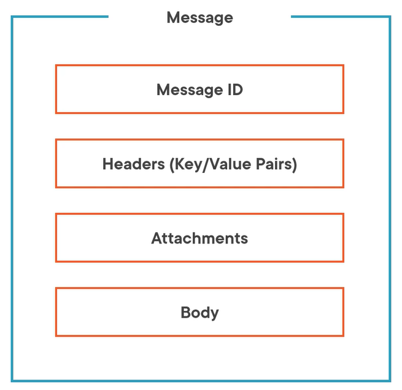
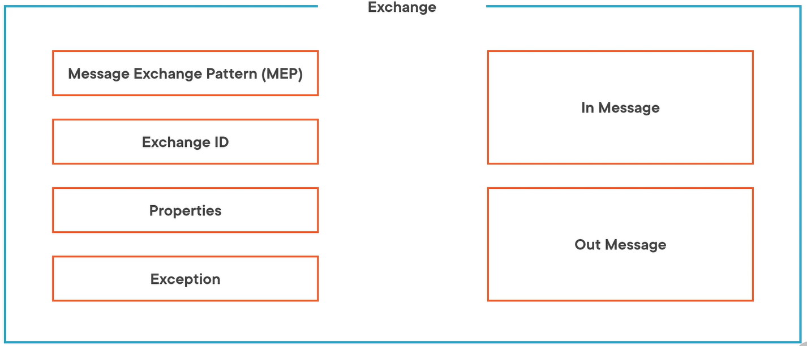
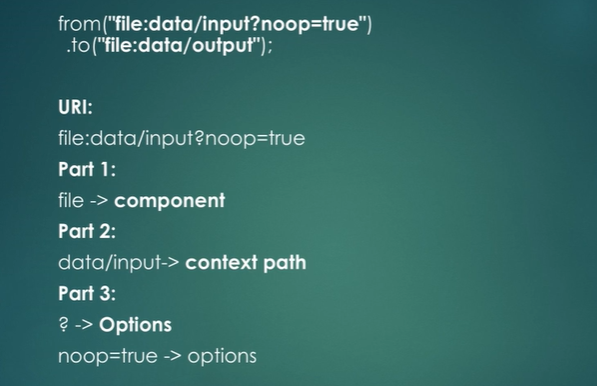
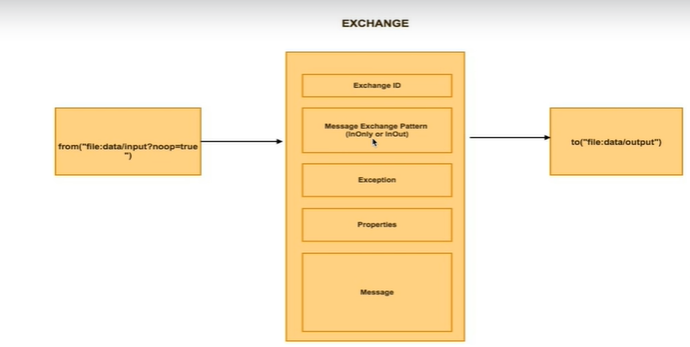
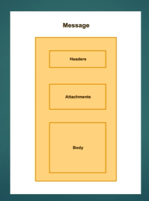
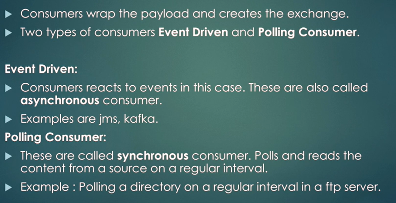
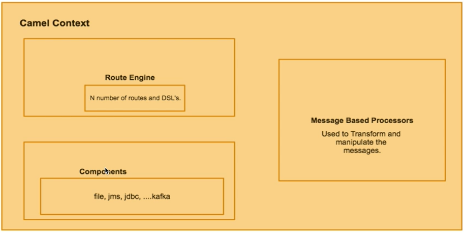
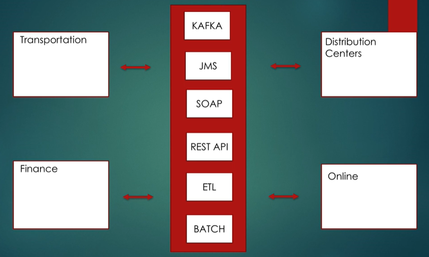

= Apache-Camel
:toc: left
:toclevels: 5
:sectnums:
:sectnumlevels: 5

NOTE: NOTE

TIP: TIP

IMPORTANT: IMPORTANT

CAUTION: CAUTION

WARNING: WARNING

[cols="1,3"]
|===
| Name | Description

| Asciidoctor
| Awesome way to write documentation

|===

== Interview Summary - DND

* Routing Message, Transformation using bindy
* File - DB - Alerting
* JMS - DB - Alerting
* Apache Kafka - DB - Alerting
* API - DB - Alerting
* Exception Handling
* Monitoring Capabilities
* Alerting Capabilities

== Fundamentals of Integration with Apache Camel By Michael Hoffman

=== Course Overview

* https://github.com/pluralsight-camel/fundamentals-of-integration-with-apache-camel

=== Camel Routing for ETL

*Integration with a Monolith Architecture*: N/a

Camel should be a separate service from the monolith. Keeping integration concerns separated from your business logic and transactional concerns allows you to evolve and scale each separately. There are some trade‑offs. The modules in your monolith now need to expose external services for routing.

The most common question to ask yourself is, how much refactoring do I need to do to isolate the logic that you're exposing for integration? Your runtime is distributed across a network. This opens a whole host of questions, including those around reliability and observability. Finally, your code is no longer centralized and delivered as a single project. This could result in more complex development and deployment. You may be thinking those are significant challenges. Why not just add Camel directly in the application? If your integration is relatively simple, one strategy is to start with Camel inside the application, but have an eye towards future separation. You can add your route and have it communicate with an integration API as a façade to your business logic. Then, when you separate the routes, the integration API can be externalized. As you add more routes, can you think of some of the scaling issues that you might face? Let's take an example where the integration is from a file. If the file is small, the resource impact to my application will be minor. But what if I have to load a large file? What if I have to integrate more files in the future? The contents of the files are going to be loaded into memory, and the route will consume threads and CPU for processing. You should be asking, how do I assure that my integration doesn't impact important business processing by the application? Next, consider the impact of routing to other endpoints. Let's say that your Camel routes need to integrate with other services like email or messaging. Similar to the file integration concerns, what happens if these services are slow? Again, the route is consuming resources that might be valuable to key business transactions, like placing orders, for example. If scaling becomes or will be a concern, separating your Camel route from your application can greatly reduce the chance of impacting the application itself. It's not foolproof though. A large number of calls to the monolith can still have the same impact on resources. However, there are strategies for reducing impact, such as adding rate limiting to the number of requests processed at a given timeframe. Hopefully this gives you a good breadth of considerations for a monolithic approach to integration. Now let's look at another architecture type.

*Drivers for Choosing Camel*: Pending

Earlier, I touched on several features that make Camel popular, including its simple and intuitive DSL, its support for automatic type conversion, and its support for over 300 components. In addition to these features, there are several drivers that you need to consider when evaluating Camel. In my opinion, the key driver for choosing Camel is if you are comfortable with custom developing your integration routes. This is opposed other popular integration products such as Apache Nifi, which come with a UI, as well as drag‑and‑drop support for route building.

Apache Camel is Java based, which means you need to understand Java in order to build your routes. If your environment already has a lot of custom development, your Camel service apps will benefit from existing development tools and frameworks, CI/CD pipelines, version control, deployment strategies, and infrastructure.

Another driver for choosing Camel is the type of production support that you require for your routes. Camel is a robust framework that provides hooks for viewing the metrics, health, and status of routes. Unlike other integration products, there's no UI for Camel out of the box; therefore, there's no visualization of support data out of the box. If you are comfortable with building out your own custom view of support data, then Caml might be the right choice for you.

Along with observing production status, the maintenance and administration of routes at production time is another consideration to make. You should be asking questions such as, do I need to increase thread count in production if processing gets backed up? Or, can I stop an individual route if it's causing performance issues? Camel support strategies for solving these; however, it requires a custom approach. Underscoring production support, and a key to success with Camel, is a sound operational strategy. This can ensure integration services are properly managed and maintained. It can also help to keep operating costs lower. For example, other integration products are often centralized and need to always be running. Having separate Camel services means you can turn off individual service runtimes or even individual routes when not being used. Hopefully this provided you with a framework for deciding whether or not to use Apache Camel. Next, I'm going to provide you with a walkthrough for designing

*What Is the Integration Problem?*

Processing file contents is a common ETL integration problem. Extracting from a file needs to take different sources and formats into consideration. Transformation complexity depends on how dispirit the source and destination formats are, as well as the rules to be applied. Loading the data also has several considerations, for example, the performance and availability of the destination.

*Designing the Route*

I'll build on this foundation by covering more advanced design considerations, such as notifications, error handling, and asynchronous processing. A good starting point of route design is understanding the frequency of route execution.

Camel supports several options for executing routes on a *scheduled* basis, including a cron‑based scheduler, support for Quartz, and support for Spring Scheduler. If your route doesn't execute on a schedule, Camel also supports a *polling* consumer. This approach is for more frequent execution, such as polling a file directory every 10 seconds for new files. Camel also supports *executing your routes on demand*. This approach is often paired with scheduled route execution. For example, if a scheduled route fails to run over the weekend because of a corrupt file, I can fix and load a valid file and then run the route on demand.

*Component Selection*

The component name is file and the URI path is a directory on the file system. One option I plan to use for the route is include. The value for the include option is a *filter*. The filter is a regex pattern that tells Camel if a file name in the directory should be included for processing.

The second option I plan to use is the *move* option. After Camel processes a file, it will move or archive the file from the directory path to the value that I specify in this option. As I mentioned earlier, the file component supports a strategy for the frequency of execution. For this route, I'll just use the default behavior, which is to constantly pull the directory for new files.

Now I need to select the component type I'll be routing to. The route needs to make a REST call to a service so it would seem obvious that a REST component would be the best option.

*Designing Route Processing Steps*

To recap the design to this point, the route will start by polling and reading a file from a share drive. And the route will end by calling a REST component with the file contents. The last step of design is to process the data from the file, transform each line, and then send the data to the service. The step of designing and implementing raw processing requires a strategy. You know your starting point, and you know your destination, but you need to figure out what steps to take in order to get there. The Camel framework is built on the pattern of pipes and filters. In order to get the most benefit out of using Camel, I need to think about how I can break a processing problem down into chunks or steps. Each step or filter has an input and an output. The output of one filter becomes the input of the next filter. This allows me to chain the steps of processing together and easily add or remove a step of logic, if needed. Pipes then connect one filter to the next. Throughout the design of your processing steps, you should be asking yourself, does Camel provide a feature for this requirement or do I really need to write my own logic? Ideally, you want to leverage Camel as much as possible as it reduces the time and effort of having to build, test, and maintain your own custom logic. I'm going to walk you through the strategy I follow for flushing out the processing design.

I start by determining the data types coming to and from my routing components. Then, I determine what logic is needed to transform the data and complete the route. The route is processing files in CSV format. I need to read the file and format the data for individual REST service requests. At this point, I would search Camel's website for a CSV formatter. Camel supports a formatter for CSV data via the Apache Commons CSV library. What does this mean for my processing step? I should be able to use the Camel DSL to define how I want Camel to unmarshall the data. The output of this step will be a list representing each line of the file, which will make it easier to process into REST requests downstream. Now that I define the data type coming into the route, I need to determine the outbound data type. Given that I'm routing to a REST service, I need to know the content type that the service endpoint accepts. In this case, it's JSON. This means I need a data formatter that will marshall the data into JSON request objects for the service to consume. To find a JSON formatter, I would again search Camel's website. While there are several options available, I'm going to choose the Jackson library. This gets us closer to the final design, but there's still a disconnect. The REST endpoint accepts a single address update, but the list of lines represents multiple address updates. I need a way to separate the lines. A common approach I would use for this scenario is Camel's implementation of the Splitter pattern. Splitter is a routing pattern that transforms a message with a collection into separate messages for individual processing. For example, the incoming message with a list of 1000 lines would be split into 1000 messages. Those messages would be individually routed to the destination. Each line output from the Splitter is, itself, a list of columns from the row in the file. The last gap is to transform each line from arbitrary strings into the REST endpoint request object. To fill this gap, I plan to implement a Mapper class. It will be a simple bean that transforms the line from the file into a customer request object. With the Mapper in place, I now have an end‑to‑end design for the route. With the design finalized, the next step is to demonstrate implementing it with Camel.

*Structuring a Camel Integration Project*

*Implementing Route Processing*

*Camel Testing Concepts*

I'll be demonstrating a route implementation where I'll be introducing several new concepts as part of unit testing. The test I create will have three annotations added. The first is an interception strategy named `@MockEndpointsAndSkip`. It defines pattern matches for any endpoints that should be auto mocked. I just need to define the mock that should act as the replacement, and Camel will take care of the rest. The second annotation I'll add is named `@UseAdviceWith`. This allows you to add or change parts of the route before it started. In our case, I want to replace the file component with my own component to take control of what file gets sent. I'm using Camel's component named Direct as it's a way to directly execute the route. The last annotation will be on a member of the test class that is of type mock endpoint. This annotation is named `@EndpointInject`, and it will tell Camel which endpoint this mock should be used in place of. Mocks allow you to perform assertions on conditions, like the number of messages received and the contents of the message body. `ProducerTemplate` is a class that allows you to produce a message to the route. For this implementation, I'm going to send a file.

=== Understanding Foundational Concepts of Camel

*How Camel Supports the Message Pattern*

---

== Apache Camel for Beginners - Learn by Coding in Java: Dilip S

*Objective*

* [ ] *History*:
* [ ] *Agenda-While doing this course what is the Agenda [1,2,3,4,5..]*:
* [ ] Exam Notes
* [ ] *Why OneNote Notes*:
* [ ] *What is Pending*:

=== Section 1: Introduction

=== Section 2: WorkSpace Setup - MAC

=== Section 3: WorkSpace Setup - Windows

=== Section 4: Coding a Simple Camel Route

*Lab : Coding a Simple Camel Route*

----
context.addRoutes(new RouteBuilder() {
    @Override
    public void configure() throws Exception {
        from("file:data/input?noop=true")
                .to("file:data/output");
    }
});
----

---

*Lab : Logging in Camel*

----
context.addRoutes(new RouteBuilder() {
    @Override
    public void configure() throws Exception {
        from("file:data/input?noop=true")
                .to("log:?level=INFO&showBody=true&showHeaders=true")
                //.log("Received Message is ${body} and Headers are ${headers}")
                .to("file:data/output");
----

---

*How Camel Transports the content ?*

---

---

*Producers and Consumers in Camel*

----
from("file:data/input?noop=true")
    .to("file:data/output");
----

* from() method creates consumer (Event Driven and Polling)

---

* Producer sends message to end-point.

=== Section 5: Camel Architecture

=== Section 6: Testing the Camel Route

*Lab : How to test the Camel Route ?*

----
public class CopyFilesRoute extends RouteBuilder {

    public void configure() throws Exception {

        from("file:data/input?noop=true")
                .to("file:data/output");

    }
}

public class CopyFilesCamelTest extends CamelTestSupport {

    @Override
    public RoutesBuilder createRouteBuilder() throws Exception {
        return new CopyFilesRoute();
    }

    @Test
    public void checkFileExistsInOutputDirectory() throws InterruptedException {

        Thread.sleep(5000);

        File file = new File("data/output");

        assertTrue(file.isDirectory());
        System.out.println("Total no of files in the output directory : " + file.listFiles().length);
        assertEquals(2, file.listFiles().length);
    }
}
----

*Lab : Testing a route using Direct Component*

It is used mainly for testing and development purpose.

* Upstream (Source) system is not available: Use direct component
* Downstream (Destination) system is not available: Use Mocking

----
public class SampleDirectRoute extends RouteBuilder {

    public void configure() throws Exception {

        //direct:sampleInput - end point
        from("direct:sampleInput")
                .log("Received Message is ${body} and Headers are ${headers}")
        .to("file:sampleOutput?fileName=output.txt");
    }
}

// Test Method

@Test
public void sampleRouteTest() throws InterruptedException {

    /**
     * Producer Template: It is used to send data to the end point
     */
    template.sendBodyAndHeader("direct:sampleInput","Hello", "hi" , 1);

    Thread.sleep(5000);

    File file = new File("sampleOutput");

    assertTrue(file.isDirectory());

    /**
     * Consumer Template.
     */
    /*Exchange exchange = consumer.receive("file:sampleOutput");

    System.out.println("Received body is :" + exchange.getIn().getBody());
    System.out.println("File Name is :" + exchange.getIn().getHeader("CamelFileName"));

    assertEquals("output.txt", exchange.getIn().getHeader("CamelFileName"));*/

}
----

*Lab : Testing a Route using Mock Component*

=== Section 7: Why Camel ?

=== Section 8: Camel Boiler Plate Code

=== Section 9: Transform Using Camel

=== Section 10: Transform Using Camel - Camel Bindy

=== Section 11: Error Handling in Camel

=== Section 12: Enterprise Integration Patterns

=== Section 13: Enterprise Integration Patterns - Aggregator - EIP

=== Section 14: App#1 - Create a Route from JMS to DB

=== Section 15: App # 2 - Create a Route from Kafka to DB

=== Section 16: App # 3 - Create a Route from REST to DB

=== Section 17: Bonus Lecture

== Apache Camel - Learn by coding in Spring Boot: Dilip S

=== Section 1: Course Objective

=== Section 2: WorkSpace Setup - MAC

===  Section 3: WorkSpace Setup -
Windows

=== Section 4: Spring Boot - Quick Intro -
Building a Simple REST API - For Spr…Section 4:
Spring Boot - Quick Intro - Building a Simple REST API - For Spring Boot Newbies

=== Section 5: Camel- Quick Intro - For Camel Newbies

=== Section 6: App# 1 - Build a Simple Camel Route -
File -> DB -> MAIL

=== Section 7: Testing a Spring Boot Camel Route - Junit

=== Section 8: Enable Logging in Spring Boot - Using LogBack and Lombok

=== Section 9: Connecting to PostGres DB

=== Section 10: Error/Exception Handling in Camel Route

=== Section 11: Alerting in Camel Spring Route

=== Section 12: Monitoring the Camel Route application Health

=== Section 13: Camel Spring Boot Boiler Plate Code

=== Section 14: App# 2 Build a Kafka
Camel Route - Kafka -> DB -> MAIL

=== Section 15: App# 3 Build a ActiveMQ
Camel Route - ActiveMQ -> DB -> MA…Section
15: App# 3 Build a ActiveMQ Camel Route - ActiveMQ -> DB -> MAIL

=== Section 16: App # 4 -Build a REST
Camel Route - REST -> RESTLET-> D…Section
16: App # 4 -Build a REST Camel Route - REST -> RESTLET-> DB -> MAIL

=== Section 17: App # 5 -Build a SOAP
Camel Route - SOAP -> Spring-WS-> …Section
17: App # 5 -Build a SOAP Camel Route - SOAP -> Spring-WS-> DB -> MAIL

=== Section 18: Coupon for my Other
Courses

